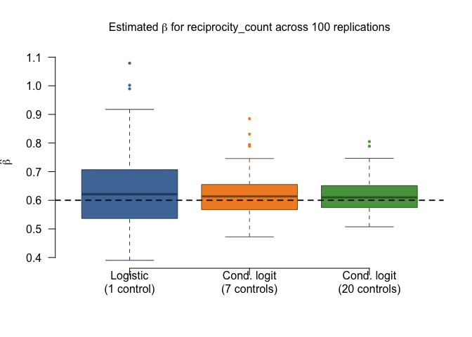

## Introduction

In the two practicals of the workshop *Introduction to Relational Event
Models*, we will show how to use `amore` to simulate relational events
and fit relational event models with increasing levels of complexity.

If you are running this tutorial locally, make sure to uncomment the
`remotes::install_github` command below to install the package.

``` r
# remotes::install_github("franciscorichter/amore")
library(amore)
```

While exploring the main functions of the package, we will cover how:

-   to simulate relational event data in `amore` \[Theoretical
    reference\]
-   to structure data for inference \[Theoretical reference\]
-   to fit models with linear effects \[Theoretical reference\]
-   different inference techniques compare \[Theoretical reference\]

## 1. How to simulate relational event data in `amore`

As seen in \[Theoretical reference\], *relational event data* consists
of a sequence of $n$ triplets:

$$E = \{e_i = (s_i, r_i, t_i), i=1,\dots,n\}$$

where $s_i\in V^S$ and $r_i\in V^R$. $V^S$ and $V^R$ are the *sender
set* and the *receiver set*, respectively.

The *number of events* (`n_events`), the *sender set* (`senders`), and
the *receiver set* (`receivers`) are the first three arguments that we
provide to simulate our relational event sequence by means of the
function `simulate_relational_events`.

Furthermore, we sa

We saw that the the dynamics of relational

``` r
set.seed(1)
raw_data_m1 <- simulate_relational_events(
  n_events           = 1000,
  senders            = paste0("a", 1:20),
  receivers          = paste0("a", 1:20),
  baseline_rate      = 1,
  endogenous_stats   = "reciprocity_count", 
  endogenous_effects = c(reciprocity_count = 0.6),
  n_controls         = 1
)
```

``` r
head(raw_data_m1,20)
```

::: r-output
<pre><code>##    stratum event sender receiver        time reciprocity_count
## 1        1     1     a3       a8 0.001987321                 0
## 2        1     0    a17       a9 0.001987321                 0
## 3        2     1    a20      a18 0.002354409                 0
## 4        2     0    a14      a16 0.002354409                 0
## 5        3     1    a11      a20 0.003031029                 0
## 6        3     0    a17      a10 0.003031029                 0
## 7        4     1     a2      a14 0.007734052                 0
## 8        4     0    a10       a5 0.007734052                 0
## 9        5     1    a14       a5 0.009142085                 0
## 10       5     0     a8      a18 0.009142085                 0
## 11       6     1    a16      a18 0.010586697                 0
## 12       6     0     a3       a5 0.010586697                 0
## 13       7     1     a5       a3 0.011374750                 0
## 14       7     0    a12       a6 0.011374750                 0
## 15       8     1    a20      a11 0.014583015                 1
## 16       8     0    a14       a9 0.014583015                 0
## 17       9     1     a1      a10 0.017310914                 0
## 18       9     0    a14       a5 0.017310914                 0
## 19      10     1    a15      a16 0.022153557                 0
## 20      10     0     a4      a16 0.022153557                 0
</code></pre>
:::

## 2. Construct datasets for two inference procedures

### 2.1. Case-$7$-control for inference via conditional logistic regression

``` r
set.seed(1)
raw_data_m7 <- simulate_relational_events(
  n_events           = 1000,
  senders            = paste0("a", 1:20),
  receivers          = paste0("a", 1:20),
  baseline_rate      = 1,
  n_controls         = 7,
  endogenous_stats   = "reciprocity_count", 
  endogenous_effects = c(reciprocity_count = 0.6),
)
```

``` r
head(raw_data_m7,10)
```

::: r-output
<pre><code>##    stratum event sender receiver        time reciprocity_count
## 1        1     1     a3       a8 0.001987321                 0
## 2        1     0    a17       a9 0.001987321                 0
## 3        1     0    a16       a7 0.001987321                 0
## 4        1     0    a15      a16 0.001987321                 0
## 5        1     0     a5      a15 0.001987321                 0
## 6        1     0    a18      a10 0.001987321                 0
## 7        1     0     a4      a17 0.001987321                 0
## 8        1     0    a10       a5 0.001987321                 0
## 9        2     1    a15       a5 0.003404473                 0
## 10       2     0     a8      a18 0.003404473                 0
</code></pre>
:::

### 2.2. Case-$1$-control dataset in "wide" format for inference via degenerate logistic regression

``` r
wide_data_m1 <- widen_case_control(raw_data_m1, case = "event", stratum= "stratum")
head(wide_data_m1)
```

::: r-output
<pre><code>##   stratum sender_ev sender_nv receiver_ev receiver_nv     time_ev     time_nv
## 1       1        a3       a17          a8          a9 0.001987321 0.001987321
## 2      10       a15        a4         a16         a16 0.022153557 0.022153557
## 3     100        a3        a2         a15          a1 0.207398477 0.207398477
## 4    1000       a18        a8         a20          a2 0.565565424 0.565565424
## 5     101        a2       a12         a17         a19 0.210725053 0.210725053
## 6     102       a11       a19         a13         a11 0.212042188 0.212042188
##   d_time reciprocity_count_ev reciprocity_count_nv d_reciprocity_count
## 1      0                    0                    0                   0
## 2      0                    0                    0                   0
## 3      0                    1                    0                   1
## 4      0                  336                    2                 334
## 5      0                    0                    0                   0
## 6      0                    0                    1                  -1
</code></pre>
:::

## 3. Inference procedures

### 3.1. Conditional logistic regression

``` r
fit_clogit <- rem(event ~ reciprocity_count, data = raw_data_m7, method = "clogit")
summary(fit_clogit)
```

::: r-output
<pre><code>## Call:
## coxph(formula = Surv(rep(1, 8000L), .case) ~ reciprocity_count + 
##     strata(.strat), data = cl, method = "exact")
## 
##   n= 8000, number of events= 1000 
## 
##                      coef exp(coef) se(coef)     z Pr(>|z|)    
## reciprocity_count 0.66848   1.95126  0.08316 8.039 9.07e-16 ***
## ---
## Signif. codes:  0 '***' 0.001 '**' 0.01 '*' 0.05 '.' 0.1 ' ' 1
## 
##                   exp(coef) exp(-coef) lower .95 upper .95
## reciprocity_count     1.951     0.5125     1.658     2.297
## 
## Concordance= 0.898  (se = 0.066 )
## Likelihood ratio test= 517.3  on 1 df,   p=<2e-16
## Wald test            = 64.62  on 1 df,   p=9e-16
## Score (logrank) test = 798.1  on 1 df,   p=<2e-16
</code></pre>
:::

### 3.2. Degenerate logistic regression

``` r
fit_glm <- rem(~ reciprocity_count, data = wide_data_m1, method = "gam")
summary(fit_glm)
```

::: r-output
<pre><code>## 
## Family: binomial 
## Link function: logit 
## 
## Formula:
## one ~ -1 + reciprocity_count
## 
## Parametric coefficients:
##                   Estimate Std. Error z value Pr(>|z|)    
## reciprocity_count  0.54154    0.09815   5.518 3.44e-08 ***
## ---
## Signif. codes:  0 '***' 0.001 '**' 0.01 '*' 0.05 '.' 0.1 ' ' 1
## 
## 
## R-sq.(adj) =   -Inf   Deviance explained = -Inf%
## UBRE = -0.55893  Scale est. = 1         n = 1000
</code></pre>
:::

## 4. Replicate the simulation study 100 times

``` r
# parameters
N_SIM        <- 100
N_EVENTS     <- 1000
TRUE_BETA    <- 0.6        
SENDERS      <- paste0("a", 1:20)
RECEIVERS    <- paste0("a", 1:20)
```

``` r
# storage
coefs <- data.frame(
  glm_1   = numeric(N_SIM),   # degenerate logistic, 1 control
  clogit_7  = numeric(N_SIM), # conditional logit,   7 controls
  clogit_20 = numeric(N_SIM)  # conditional logit,  20 controls
)
```

``` r
for (i in seq_len(N_SIM)) {
  
  set.seed(i)
  
  # case-1-control dataset
  d1 <- simulate_relational_events(
    n_events           = N_EVENTS,
    senders            = SENDERS,
    receivers          = RECEIVERS,
    baseline_rate      = 1,
    n_controls         = 1,
    endogenous_stats   = "reciprocity_count", 
    endogenous_effects = c(reciprocity_count = TRUE_BETA),
  )
  
  # fit degenerate logistic regression
  wide_d1 <- widen_case_control(d1, case = "event", stratum = "stratum")
  fit_glm <- rem(~ reciprocity_count, data = wide_d1, method = "gam")
  coefs$glm_1[i] <- coef(fit_glm)[["reciprocity_count"]]
  
  
  # case-7-control dataset
  d7 <- simulate_relational_events(
    n_events           = N_EVENTS,
    senders            = SENDERS,
    receivers          = RECEIVERS,
    baseline_rate      = 1,
    n_controls         = 7,
    endogenous_stats   = "reciprocity_count", 
    endogenous_effects = c(reciprocity_count = TRUE_BETA)
  )
  
  fit_clogit_7 <- rem(event ~ reciprocity_count, data = d7, method = "clogit")
  coefs$clogit_7[i] <- coef(fit_clogit_7)[["reciprocity_count"]]
  
  # case-20-control dataset
  d20 <- simulate_relational_events(
    n_events           = N_EVENTS,
    senders            = SENDERS,
    receivers          = RECEIVERS,
    baseline_rate      = 1,
    n_controls         = 20,
    endogenous_stats   = "reciprocity_count", 
    endogenous_effects = c(reciprocity_count = TRUE_BETA),
  )
  
  fit_clogit_20 <- rem(event ~ reciprocity_count, data = d20, method = "clogit")
  coefs$clogit_20[i] <- coef(fit_clogit_20)[["reciprocity_count"]]
  
  if (i %% 10 == 0) message(sprintf("  Completed %d / %d replications", i, N_SIM))
  
  
}
```

    ##   Completed 10 / 100 replications

    ##   Completed 20 / 100 replications

    ##   Completed 30 / 100 replications

    ##   Completed 40 / 100 replications

    ##   Completed 50 / 100 replications

    ##   Completed 60 / 100 replications

    ##   Completed 70 / 100 replications

    ##   Completed 80 / 100 replications

    ##   Completed 90 / 100 replications

    ##   Completed 100 / 100 replications

``` r
coefs_long <- stack(coefs)
levels(coefs_long$ind) <- c(
  "Logistic\n(1 control)",
  "Cond. logit\n(7 controls)",
  "Cond. logit\n(20 controls)"
)
cols <- c("#4E79A7", "#F28E2B", "#59A14F")
```

``` r
boxplot(
  values ~ ind,
  data       = coefs_long,
  col        = cols,
  border     = darken <- adjustcolor(cols, red.f = 0.6, green.f = 0.6, blue.f = 0.6),
  outcol     = cols,
  outpch     = 16,
  cex        = 0.6,
  las        = 1,
  xlab       = "",
  ylab       = expression(hat(beta)),
  main       = expression(
    "Estimated "*beta*" for reciprocity_count across 100 replications"
  ),
  cex.main   = 1.0,
  cex.lab    = 0.95,
  frame.plot = FALSE
)
abline(h = TRUE_BETA, lty = 2, lwd = 1.8, col = "black")
```


