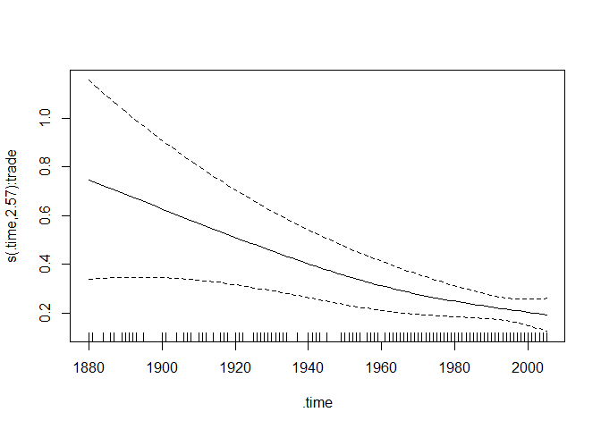
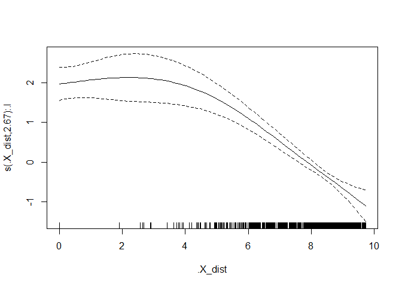

## Introduction

In this practical, we will show how to use relational event models
beyond linear effect specification, in the context of the first time
invasion of species into regions over time. (Boschi et al., 2025). We
will show how to fit models with time-varying, non-linear and random
effects to gain insight on how climatological, economical and
geographical aspect might explain the dynamics of this ecological
process.

------------------------------------------------------------------------

## 1. Package requirements and setup

If you are running this tutorial locally, make sure to uncomment the
`remotes::install_github command` below to install the package.

    # install.packages("remotes")
    # install.packages("pbapply")
    # remotes::install_github("franciscorichter/amorem")

    library(amorem)
    library(pbapply)

------------------------------------------------------------------------

## 2. Data uploading, inspection and cleaning

Load the input data `input00.RData` located in the `01-Data/01-Inputs`
folder. Inspect the original data contained in . Have a look at the
following columns of the object `FR`: `LifeForm`, `Taxon`, `Region`,
`FirstRecord`, `Source`.

    load(file="01-Data/01-Inputs/input00.RData")

    head(FR[,c("LifeForm", "Taxon",
               "Region", "FirstRecord",
               "Source")])

<pre><code>##   LifeForm                     Taxon           Region FirstRecord
## 1    Algae    Acanthophora muscoides           Turkey        1986
## 2    Algae Acanthophora nayadiformis           Cyprus        1997
## 3    Algae Acanthophora nayadiformis           Turkey        1970
## 4    Algae    Acanthophora spicifera Hawaiian Islands        1952
## 5    Algae    Acetabularia caliculus           Israel        1943
## 6    Algae    Acetabularia caliculus            Spain        1957
##                     Source
## 1      Cinar et al. (2005)
## 2                   DAISIE
## 3      Cinar et al. (2005)
## 4 Carlton & Eldrege (2009)
## 5                   DAISIE
## 6                   DAISIE
</code></pre>

We firstly show how data arrives from the original source (Seebens et
al., 2018). These data involve 17 life forms. For each record, we are
able to identify the **species** (`Taxon`) of a certain **lifeform**
(`Lifeform`) that is invading a **region** (`Region`) in which it was
not native and was not seen before the reported **year**
(`FirstRecord`). The Alien Species First Records Database collects
several sources: the source of each FR is reported in the column
`Source`.

A **first record** (FR) is the year *t* when a (non-native) species *s*
first invades region *r*. The following dataset, `FR`, already contains
information we need to interpret first records as *relational events*
(*s*, *r*, *t*).

Particularly, the *sender set* *V**S* is composed of the
unique recorded species, while regions of the world (countries and
islands) form the *receiver set* *V**R*. The *time window*
spans from *t*0 = 1880 to *T* = 2005.

A species’ **native range** (NR) is the collection of areas where it is
indigenous. Slightly more liberally, we refer to native range as the set
of sites where a species was already present before the start of the
analysis period, which in this context is 1880. The object `native`
contains such information.

    native[sample(1:nrow(native), 10), c("species", "region")]

<pre><code>##                        species                           region
## 1032140         Vespa velutina                        Indonesia
## 996159     Aonidomytilus albus Saint Vincent and the Grenadines
## 1005925   Diabrotica virgifera                       Costa Rica
## 1029179    Schistocerca nitens                        Guatemala
## 1020877  Paracoccus marginatus                           Mexico
## 1025370 Prostephanus truncatus                           Panama
## 1032211      Vespula germanica                         Bulgaria
## 1031953     Tremex fuscicornis                           Latvia
## 1032224      Vespula germanica                          Algeria
## 1009056          Hylastes ater                           Norway
</code></pre>

This information is crucial for the definition of the *risk set*. If a
species is native in a region, then such dyad is never at risk of
occurring ever during our analyzed time window. Additionally, the
relational event is **non-recurrent**, namely, the event first record,
for its definition, occurs only once. This also means that the risk set
is reducing over time: once the event is observed, it cannot be sampled
anymore as a non-event. Also, if interested in computing *endogenous
covariates* (that depend on prior interactions), such information is
necessary for the events occurring at the beginning (1880).

In this tutorial, in order to make the analysis easy to reproduce, we
focus on **insects** only. `first_records` contains the insect FRs of
interest.

    head(first_records[,c("year","lf",
               "species", 
               "region")])

<pre><code>##       year      lf                species        region
## 9337  1880 Insects  Adelges nordmannianae   Switzerland
## 15937 1881 Insects   Pheidole megacephala        France
## 16225 1884 Insects            Pineus pini   New Zealand
## 12792 1886 Insects       Eulachnus rileyi United States
## 14019 1887 Insects     Linepithema humile      Portugal
## 11797 1889 Insects Ctenarytaina eucalypti   New Zealand
</code></pre>

We know format the data in a convenient manner for analysis using
`amorem` package. We need to make sure that both the data structures for
the sequence of relational events and the set of dyads not at risk at
the beginning of the time-window contain a `sender` and `receiver`
column.

    event_log <- standardize_event_log(first_records[,c(1,3:4)],
                                       sender_col = "species",
                                       receiver_col = "region",
                                       time_col = "year")
      
    head(event_log)

<pre><code>##                   sender      receiver time
## 1  Adelges nordmannianae   Switzerland 1880
## 2   Pheidole megacephala        France 1881
## 3            Pineus pini   New Zealand 1884
## 4       Eulachnus rileyi United States 1886
## 5     Linepithema humile      Portugal 1887
## 6 Ctenarytaina eucalypti   New Zealand 1889
</code></pre>

    native_df<-native[, c("species", "region")]
    colnames(native_df)<-c("sender", "receiver")
    head(native_df)

<pre><code>##                sender    receiver
## 994830 Adelges piceae      Turkey
## 994831 Adelges piceae Switzerland
## 994832 Adelges piceae      Greece
## 994833 Adelges piceae     Romania
## 994834 Adelges piceae      Serbia
## 994835 Adelges piceae     Germany
</code></pre>

In addition we have information on 2 dyadic attribute, **distance** and
**trade** between regions, and on a species-level attribute,
**temperature**.

Regarding climate, `data_temperature` contains the names of the
countries in the first column and the average values of near-surface air
temperature in the second column (Watanabe et al., 2011).

    head(data_temperature)

<pre><code>##                  X     temp
## 1           Turkey 12.76058
## 2           Cyprus 19.20573
## 3 Hawaiian Islands 23.70886
## 4           Israel 19.81427
## 5            Spain 14.10500
## 6         Bulgaria 13.91744
</code></pre>

For trade, the source information, derived from Barbieri et al. (2009),
`data_trade` reports trade flows among countries.

    head(data_trade)

<pre><code>##   X donorID recipientID year transfer  FromRegion ToRegion
## 1 1       1           2 2007        0 Afghanistan  Albania
## 2 2       1           2 2008        0 Afghanistan  Albania
## 3 3       1           2 2009        0 Afghanistan  Albania
## 4 4       1           3 1962        0 Afghanistan  Algeria
## 5 5       1           3 1963        0 Afghanistan  Algeria
## 6 6       1           3 1964        0 Afghanistan  Algeria
</code></pre>

Distance between regions is computed referring to the closest borders
and consequently is equal to zero for neighbours. Source data for this
driver consists of the `R` package `geosphere` (Hijmans et al.,
2017).`data_distance` is a matrix with dimension names referring to the
regions. The corresponding element in the matrix reports the distance
between the two.

    data_distance[1:3,1:3]

<pre><code>##                       Turkey      Cyprus Hawaiian Islands
## Turkey               0.00000    95.54336         12894.77
## Cyprus              95.54336     0.00000         13791.72
## Hawaiian Islands 12894.76706 13791.71607             0.00
</code></pre>

We will leverage this information to investigate the effect of
temperature, trade and distance in the dynamics of species invasion.

------------------------------------------------------------------------

## 3. Case-control sampling from the risk set

To perform inference by maximizing the *sampled partial likelihood*
through the fitting of a *degenerate logistic* model we need to perform
*case-1-control sampling*. In particular, for each observed event, we
sample uniformly at random from the risk set at the time of the event, a
*non-event* dyad.

Given the time granularity, we have that multiple invasions occur the
same year. In order to address these *ties*, for each event, we exclude
from the risk set at that time, all the first records that occurred in
the same year.

    set.seed(1234)
    cc <- sample_non_events(event_log,
                            n_controls = 1,              # 1 control is default
                            scope         = "all",
                            mode          = "two",
                            risk          = "remove",          # drops past + concurrent
                            exclude_pairs = native_df[,1:2])   ### excludes native dyads

    head(cc)

<pre><code>##   stratum event                sender    receiver time
## 1       1     1 Adelges nordmannianae Switzerland 1880
## 2       1     0   Aonidomytilus albus      Greece 1880
## 3       2     1  Pheidole megacephala      France 1881
## 4       2     0  Epiphyas postvittana      Jordan 1881
## 5       3     1           Pineus pini New Zealand 1884
## 6       3     0   Xyleborus glabratus    Slovakia 1884
</code></pre>

Notice the long format of the case-control dataset: events and
non-events appear on different rows. In particular each event row
(`event = 1`) is followed by the corresponding sample non-event
(`event = 0`).

------------------------------------------------------------------------

## 4. Computing endogenous covariates leveraging exogenous information

We now will combine the exogenous attributes with the relational event
info and define 3 endogenous covariates, describing aspects of trade,
distance and temperature that might explain invasion dynamics.

**Climate dissimilarity (via temperature).** This covariate, given a
relational event (and all the relevant information), computes the
minimum temperature difference between the region involved and the
previously invaded regions by the considered species. It depends on both
the sender and the receiver of the event and can therefore be considered
a *dyad-level covariate*. It is *time-dependent* but does not
incorporate information about internal time. It is *endogenous*, as it
relies on the regions previously invaded by the species, but it also
incorporates exogenous information.

**Trade.** In the existing literature, **international trade** has been
recognized as a key factor in explaining the spread of alien species.
Here, we consider trade as the yearly commerce between already-invaded
territories and the involved region. This also is a dyad-level,
endogenous covariate.

**Distance.** In this instance, given a relational event (and all the
relevant information that is required), we compute the shortest distance
among the regions in which the species is already present at that time
and log-transform it.

Notice that the endogenous component is common to all of them and it
involves **past invaded regions by the considered species**. For the
invasions occurring in 1880, the past invaded regions are the ones
included in `native` for that species. To make sure the function treats
it as such we hard-code a `time` column for these dyads with value 1879.
In addition, note that such covariate computation is to be done for both
events and non-events. For the latter ones, the past information must
always be only relative the actual observed events.

    ## Invaded regions ####
    native_df<-data.frame(native_df, time = "1879")
    feats <- compute_endogenous_features(cc, stats = "sender_receivers_set",
                                             history_log = event_log, prior_log = native_df)

    ## remove current region to avoid zero difference
    feats$invaded<- mapply(setdiff,feats$sender_receivers_set,feats$receiver)

    print(feats[1:3,])

<pre><code>##   stratum event                sender    receiver time
## 1       1     1 Adelges nordmannianae Switzerland 1880
## 2       1     0   Aonidomytilus albus      Greece 1880
## 3       2     1  Pheidole megacephala      France 1881
##                                                                                                                                                                                                                                                                                                                                             sender_receivers_set
## 1                                                                                                                                                                                                                                                                                                                               Georgia, Turkey, Russia, Germany
## 2 Grenada, Colombia, British Virgin Islands, Guadeloupe, Jamaica, Haiti, Antigua and Barbuda, Guyana, Cuba, Virgin Islands, US, Saint Vincent and the Grenadines, Honduras, Suriname, Dominica, Martinique, Dominican Republic, Brazil, French Guiana, Argentina, Saint Lucia, Puerto Rico, Saint Kitts and Nevis, Trinidad and Tobago, Montserrat, Peru, Mexico
## 3                                                                                                                                Guinea, Sao Tome and Principe, Zanzibar Island, Eritrea, Ethiopia, Sudan, Kenya, Nigeria, Sierra Leone, Congo, Democratic Republic of the, Ghana, Angola, Cameroon, Gabon, Senegal, Mozambique, South Africa, Zimbabwe, Madeira
##                                                                                                                                                                                                                                                                                                                                                          invaded
## 1                                                                                                                                                                                                                                                                                                                               Georgia, Turkey, Russia, Germany
## 2 Grenada, Colombia, British Virgin Islands, Guadeloupe, Jamaica, Haiti, Antigua and Barbuda, Guyana, Cuba, Virgin Islands, US, Saint Vincent and the Grenadines, Honduras, Suriname, Dominica, Martinique, Dominican Republic, Brazil, French Guiana, Argentina, Saint Lucia, Puerto Rico, Saint Kitts and Nevis, Trinidad and Tobago, Montserrat, Peru, Mexico
## 3                                                                                                                                Guinea, Sao Tome and Principe, Zanzibar Island, Eritrea, Ethiopia, Sudan, Kenya, Nigeria, Sierra Leone, Congo, Democratic Republic of the, Ghana, Angola, Cameroon, Gabon, Senegal, Mozambique, South Africa, Zimbabwe, Madeira
</code></pre>

The following code computes, for each event/non-event, the minimum
absolute difference between the current region and all past invaded
regions by the considered species. We refer to it as **climate
dissimilarity**.

    ## Temperature ####

    compound_region_map <- list(
      "USACanada" = c("United States", "Canada")
    )

    get_temp <- function(region,compound_areas = compound_region_map) {
      if (region %in% data_temperature$X) {
        return(data_temperature[data_temperature$X == region, "temp"][1])
      }
      if (region %in% names(compound_areas)) {
        parts <- compound_region_map[[region]]
        temps <- data_temperature[data_temperature$X %in% parts, "temp"]
        if (length(temps) > 0) return(mean(temps, na.rm = TRUE))
      }
      return(NA_real_)
    }

    dt_value <- mapply(function(invaded_regions, current_region) {
      
      if (length(invaded_regions) == 0) return(NA_real_)
      
      avg_temp_invaded  <- sapply(invaded_regions, get_temp)
      avg_temp_interest <- get_temp(current_region)
      
      if (is.na(avg_temp_interest) || all(is.na(avg_temp_invaded))) 
        return(NA_real_)
      
      min(abs(avg_temp_invaded - avg_temp_interest), na.rm = TRUE)
      
    }, feats$invaded, feats$receiver)

    feats$temp  <- dt_value

The following code computes the **trade** variable that captures the
log-transformed sum of the most recent recorded trade flows into a
region from each previously invaded region. A few notes on data
pre-processing:

-   Negative values of trade are considered equal to 0.

-   When a pair of nations is never mentioned in the source data, the
    trade volume is presumed to be 0, based on the idea that if a value
    is never recorded, it should be negligible.

-   When the pair is mentioned but there is a non-imputed gap at the
    time of interest, the trade flow is evaluated based on the latest
    available year for which information is available.

-   Because trade varies by orders of magnitude, we take a
    log-transformation for the analysis.

<!-- -->

    ## Trade ####

    t <- which(data_trade$transfer < 0)
    data_trade$transfer[t] <- 0
    trade_value <- pbmapply(function(invaded_regions, current_region, y) {
      trade_funct_new <- function(to_region) {
        if (length(invaded_regions) == 0) return(0)
        x <- data_trade[
          data_trade$FromRegion %in% invaded_regions &
            data_trade$ToRegion   == to_region &
            data_trade$year       <= y,
        ]
        if (nrow(x) == 0) return(0)
        most_recent <- aggregate(x$year, list(x$FromRegion), FUN = max)
        trade_vals <- mapply(function(region, max_year) {
          x$transfer[x$FromRegion == region & x$year == max_year]
        }, most_recent[, 1], most_recent[, 2])
        log(sum(unlist(trade_vals), na.rm = TRUE) + 1)
      }
      if (current_region == "USACanada") {
        mean(c(trade_funct_new("United States"),
               trade_funct_new("Canada")))
      } else {
        trade_funct_new(current_region)
      }
    }, feats$invaded, feats$receiver, feats$time)

    feats$trade<- trade_value

Now we account for the geographic aspect, through **distance**, which is
compute as the logged minimum geographic distance between the current
region and any previously invaded region.

    ## Distance ####

    distance_value <- pbmapply(function(invaded_regions, current_region, y) {
      
      if (length(invaded_regions) == 0) return(NA_real_)
      
      distances <- data_distance[current_region, invaded_regions]
      
      log(min(distances, na.rm = TRUE) + 1)
      
    }, feats$invaded, feats$receiver, feats$time)

    feats$dist <- distance_value

For fitting the models, it is convenient to transform the case-1-control
dataset and related covariates, contained in `feats` from long-format
(event on one row and corresponding non-event in the following row) to
wide-format, in which the event and non-event appear in the same row.

    cc_wide <- widen_case_control(feats, case = "event",stratum = "stratum")
    head(cc_wide)

<pre><code>##   stratum                sender_ev                sender_nv      receiver_ev
## 1       1    Adelges nordmannianae      Aonidomytilus albus      Switzerland
## 2      10 Simosyrphus grandicornis      Elatobium abietinum Hawaiian Islands
## 3     100   Phloeomyzus passerinii        Bostrichus micans    United States
## 4     101   Wasmannia auropunctata      Phlyctinus callosus          Bahamas
## 5     102       Xyleborus germanus     Epiphyas postvittana          Germany
## 6     103      Cerataphis lataniae Phylacteophaga froggatti          Germany
##   receiver_nv time_ev time_nv d_time    temp_ev   temp_nv      d_temp trade_ev
## 1      Greece    1880    1880      0 0.73696945  1.365423  -0.6284538 3.735030
## 2     Morocco    1892    1892      0 1.16153585  5.598858  -4.4373218 0.000000
## 3    Barbados    1950    1950      0 0.56376192 29.418563 -28.8548011 7.193977
## 4       Aruba    1951    1951      0 0.01698433  7.596145  -7.5791606 2.200866
## 5      Jordan    1951    1951      0 0.56376192  2.973945  -2.4101828 5.471700
## 6        Cuba    1952    1952      0 1.54595500  3.482238  -1.9362830 4.827934
##    trade_nv    d_trade  dist_ev  dist_nv    d_dist
## 1 0.0000000  3.7350301 0.000000 8.927186 -8.927186
## 2 0.7883392 -0.7883392 8.910215 6.741775  2.168439
## 3 0.0000000  7.1939768 8.085052 9.054070 -0.969018
## 4 0.0000000  2.2008664 5.197644 9.241599 -4.043955
## 5 0.0000000  5.4717001 6.821410 8.147374 -1.325964
## 6 0.0000000  4.8279338 0.000000 9.557024 -9.557024
</code></pre>

## 4. Fitting models with flexible effects using degenerate logistic trick

We will now fit 3 separate models, each of them with one of the 3
covariates and specify different type of effects.

Let us start with a model that assume a **linear effect on climatic
dissimilarity**:

    ## Fixed linear effect of Temperature ####
    m1_only_temp_l<- rem(~ temp, data = cc_wide, method = "gam")
    summary(m1_only_temp_l)

<pre><code>## 
## Family: binomial 
## Link function: logit 
## 
## Formula:
## one ~ -1 + temp
## 
## Parametric coefficients:
##      Estimate Std. Error z value Pr(>|z|)    
## temp -0.14915    0.02002  -7.448 9.44e-14 ***
## ---
## Signif. codes:  0 '***' 0.001 '**' 0.01 '*' 0.05 '.' 0.1 ' ' 1
## 
## 
## R-sq.(adj) =   -Inf   Deviance explained = -Inf%
## UBRE = 0.2584  Scale est. = 1         n = 586
</code></pre>

The coefficient for climatic dissimilarity, which remains constant over
time, is negative. This indicates that the rate of invasions tends to
increase if the species has already invaded countries with similar
temperatures.

Now consider a model with a **time-varying effect for trade**. Note the
effect changes over time, potentially non-linearly, but it is linear in
the covariate. `tv()` and the specification of `time=...` are required
for such an effect, when using `rem()` function.

    ## Time-varying linear effect ####
    m2_only_trade_tv<- rem(~ tv(trade),time = "time_ev", data = cc_wide, method = "gam")
    summary(m2_only_trade_tv)

<pre><code>## 
## Family: binomial 
## Link function: logit 
## 
## Formula:
## one ~ -1 + s(.time, by = trade)
## 
## Approximate significance of smooth terms:
##                  edf Ref.df Chi.sq p-value    
## s(.time):trade 2.565  2.936  121.3  <2e-16 ***
## ---
## Signif. codes:  0 '***' 0.001 '**' 0.01 '*' 0.05 '.' 0.1 ' ' 1
## 
## R-sq.(adj) =   -Inf   Deviance explained = -Inf%
## UBRE = 0.093859  Scale est. = 1         n = 586
</code></pre>

    plot(m2_only_trade_tv)

The effect of trade is positive throughout but, appears to be decreasing
over the time period. So greater trade flows between regions, increase
the chance of an invasion but such trend used to be strongeri in the
past. It could be the result of introduction of international norms and
laws that regulate non-indigenous species importation.

We now fit a model with a **non-linear effect of distance**. Notice the
`nl()` to specify it.

    ## Non-linear effect of distance ####
    m3_only_dist_nl<- rem(~ nl(dist), data = cc_wide, method = "gam")
    summary(m3_only_dist_nl)

<pre><code>## 
## Family: binomial 
## Link function: logit 
## 
## Formula:
## one ~ -1 + s(.X_dist, by = .I)
## 
## Approximate significance of smooth terms:
##                edf Ref.df Chi.sq p-value    
## s(.X_dist):.I 2.67  3.241    153  <2e-16 ***
## ---
## Signif. codes:  0 '***' 0.001 '**' 0.01 '*' 0.05 '.' 0.1 ' ' 1
## 
## R-sq.(adj) =   -Inf   Deviance explained = -Inf%
## UBRE = -0.037494  Scale est. = 1         n = 586
</code></pre>

    plot(m3_only_dist_nl)

From the estimated non-linear effect, which presents an overall
descreasing trend, we have that the greater the distance between 2
countries the less likely it is for species to invade from one to other.

We now consider a model with a **sender-level random intercept**. The
purpose of random effects is to account for node/dyad-level
heterogeneity. In this case, the assumption is that not all species are
the same, in the sense that some might have a tendency to invade more
than others. Such a random intercept accounts for that and is specified
in the code using `re()`:

    m4_only_sender_re<- rem(~ re(sender), data = cc_wide, method = "gam")
    summary(m4_only_sender_re)

<pre><code>## 
## Family: binomial 
## Link function: logit 
## 
## Formula:
## one ~ -1 + s(.RE_sender, by = .I, bs = "re")
## 
## Approximate significance of smooth terms:
##                    edf Ref.df Chi.sq p-value    
## s(.RE_sender):.I 66.17    113  187.7  <2e-16 ***
## ---
## Signif. codes:  0 '***' 0.001 '**' 0.01 '*' 0.05 '.' 0.1 ' ' 1
## 
## R-sq.(adj) =   -Inf   Deviance explained = -Inf%
## UBRE = 0.090173  Scale est. = 1         n = 586
</code></pre>

    re.species <- coefficients(m4_only_sender_re)

    #### rem with re() effect specification fits a random intercept based on the specified group var
    #### it handles factor encoding internally which renders used of output less intuitive.
    #### the following replicates the mapping from group var format to factor in order to print results in the original format
    ev <- cc_wide[["sender_ev"]]
    nv <- cc_wide[["sender_nv"]]
    fmat <- factor(c(as.character(ev), as.character(nv))) # Replicate what rem() does internally
    names(re.species) <- levels(fmat)  # The mapping: index 1 = levels(fmat)[1], index 2 = levels(fmat)[2], etc.

The 5 most and less invasive species:

    print(sort(re.species, decreasing = TRUE)[1:5])

<pre><code>## Frankliniella occidentalis        Bactrocera invadens 
##                   2.274299                   1.639043 
##   Maconellicoccus hirsutus            Cinara cupressi 
##                   1.580303                   1.572862 
##         Linepithema humile 
##                   1.412004
</code></pre>

    print(sort(re.species)[1:5])

<pre><code>##         Curculio conicus    Euwallacea fornicatus      Aonidomytilus albus 
##                -1.216330                -1.215159                -1.115053 
## Phylacteophaga froggatti    Xylosandrus compactus 
##                -1.111348                -1.078661
</code></pre>

We conclude this section by fitting a model with all 4 effects combined
and perform model comparison using AIC.

    ## Full model ####
    m5_full <- rem(~ temp + 
                     tv(trade) + 
                     nl(dist) +
                     re(sender), time = "time_ev", data = cc_wide, method = "gam")

    aic_table <- data.frame(
      model     = c("dt_only", "tr_only", "d_only", "sp_only", "complete"),
      AIC       = c(AIC(m1_only_temp_l), AIC(m2_only_trade_tv), AIC(m3_only_dist_nl),
                    AIC(m4_only_sender_re), AIC(m5_full))
    )
    aic_table <- aic_table[order(aic_table$AIC), ]
    print(aic_table)

<pre><code>##      model      AIC
## 5 complete 443.2659
## 3   d_only 564.0287
## 4  sp_only 638.8412
## 2  tr_only 641.0017
## 1  dt_only 737.4233
</code></pre>

Among the 5 fitted models, the complete one has better predictive
performance.
